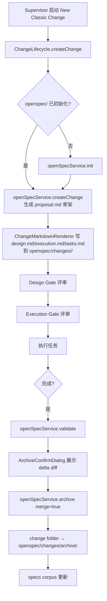
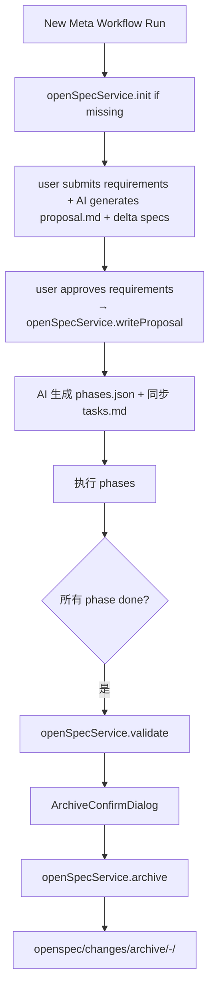

# OpenSpec × Supervisor 融合设计

## 0. 状态

- 版本：v0.1（draft / 待评审）
- 日期：2026-05-21
- 范围：Supervisor 模式（Classic Change + Meta Workflow）下，把 OpenSpec 提升为 project 级共享 spec 底座

---

## 1. 背景与现状

### 1.1 我们已有什么

Supervisor 已实现 v1 spec-driven workflow（见 `docs/design/supervisor-spec-driven-workflow-v1.zh-CN.md`），落地在 `server/src/domains/supervision/`：

| 组件 | 作用 |
|------|------|
| `BaselineService` | 维护 project 长期基线（project.md / architecture.md / features/） |
| `ChangeLifecycle` | `ProjectChange` 实体的全生命周期（draft → design → execution → executing → completed） |
| `ChangeMarkdownRenderer` | 生成 change.md / design.md / execution.md / tasks.md 文件 |
| `ContextManager.scaffoldChangeWorkspace` | 写到 `<projectRoot>/.supervision/changes/<id>/` |
| `change-gate-review` 表 | Design Gate / Execution Gate 评审记录 |
| `change-sync-run` 表 | 完成后同步回 spec 的运行记录 |

Meta Workflow（Phase A-F，已落地）走另一条线：
- requirements doc 路径用户自填
- phases.json 落库（`meta_workflow_runs.phases_json`）
- 每个 phase 产出 commit + reuse pool item
- **没有持久化的项目 spec corpus**

### 1.2 OpenSpec 关键概念回顾

OpenSpec（`.3rd-party/OpenSpec`, `@fission-ai/openspec@1.3.1`）核心三件事：

1. **持久化 spec corpus**：`openspec/specs/<capability>/spec.md` 描述系统**行为契约**。每个 requirement 必有 scenario（Given/When/Then），使用 RFC 2119 关键字（MUST/SHOULD/MAY）。
2. **Change as Delta**：`openspec/changes/<change-id>/` 包含 `proposal.md` + `design.md` + `tasks.md` + `specs/<capability>/spec.md`（**delta** 形式，只描述 ADDED/MODIFIED/REMOVED）。
3. **Archive-on-merge**：change 完成时，`openspec/changes/archive/<date>-<change-id>/` 留档，delta 合回 `openspec/specs/`。

库形态：纯 Markdown + YAML 元数据，文件系统是唯一真相源。命令类（`ChangeCommand` / `SpecCommand` / `ValidateCommand` / `ArchiveCommand`）支持 `noInteractive: true` 程序化调用。

---

## 2. Gap 分析

| 维度 | MyClaudia 现状 | OpenSpec 提供 | Gap |
|------|---------------|--------------|-----|
| project 长期文档 | ✅ `BaselineService` | ✅ `openspec/specs/` | **格式不同**，无 delta 合并能力 |
| 单次 change 文档 | ✅ `.supervision/changes/<id>/` | ✅ `openspec/changes/<id>/` | 目录命名 / 子文件清单不同 |
| Design / Execution Gate | ✅ 双 gate 状态机 | ❌ 无对应 gate | OpenSpec 没有，不冲突 |
| Task 执行 | ✅ Supervision 任务编排 | ❌ 不负责执行 | OpenSpec 不重叠 |
| Phase 编排 | ✅ Meta Workflow phases.json | ❌ 无 | OpenSpec 不重叠 |
| **Delta spec** | ❌ **无** | ✅ ADDED/MODIFIED/REMOVED 块 | **核心 gap** |
| **Archive-on-merge** | ❌ **无**（有 sync_run 表，无文件合并实现） | ✅ `ArchiveCommand` | **核心 gap** |
| Spec 校验 | ❌ 无结构校验 | ✅ `ValidateCommand` | 次要 gap |
| AI prompt 模板 | 自有 | ✅ skill / command 模板 | 不直接整合 |

**结论：核心融合点是 OpenSpec 的 "持久化 spec corpus + delta + archive" 三件套**，其余（gate / task / phase 编排）保留 MyClaudia 现有实现。

---

## 3. 目标 & 非目标

### 3.1 目标

1. 每个 supervised project 拥有一份持久化的 `openspec/specs/` corpus，跨多次 change 累积。
2. **Classic Change** 完成时，自动产出 delta-spec、archive、merge 回 corpus。
3. **Meta Workflow run** 完成时，同样的 archive + merge 流程（每个 run 视为一个 OpenSpec change）。
4. UI 提供 project specs 浏览（read-only）+ active/archived changes 浏览。
5. 校验：所有写入的 spec / delta 必须通过 OpenSpec ValidateCommand。

### 3.2 非目标

1. **不替换** Supervisor 现有的 Baseline / Gate / Lifecycle 机制——OpenSpec 仅作为 spec 底座。
2. **不嵌入** OpenSpec 的 skill / command 模板生成（我们用自己的 prompt）。
3. **不暴露** OpenSpec CLI 给最终用户；所有交互走 MyClaudia UI。
4. 不做 OpenSpec workspace（多 repo）功能；MyClaudia 已有自己的 multi-project 模型。
5. 不强制改造现有 `.supervision/changes/<id>/` 已存档历史；只对新 change 启用 OpenSpec 路径（向前兼容）。

---

## 4. 架构决策

### 4.1 ADR-1：openspec/ 放工作树而非数据目录

**决策**：`openspec/` 落在 project working tree 根目录（与 `.supervision/` 同级），不放 `~/.my-claudia/`。

**理由**：
- OpenSpec 默认假设；其库的 path 解析都以 cwd 为基准。
- 让 spec corpus 跟 git 同源管理（提交、回滚、code review 都自然）。
- 用户可单独把 `openspec/` 复制到别处或集成到他们已有的 OpenSpec 工作流。

### 4.2 ADR-2：库 import 而非 shell-out CLI

**决策**：把 `.3rd-party/OpenSpec` 改造为 pnpm workspace 依赖（`@fission-ai/openspec` 引用本地路径），server 直接 import `ChangeCommand` / `SpecCommand` / `ValidateCommand` / `ArchiveCommand`。

**理由**：
- 避免 spawn Node + 解析 JSON 输出的成本。
- 直接捕获异常、共享 SQLite 事务上下文。
- 仍可随时升级到 npm 发布版本（升级路径不变）。
- 备选方案：shell-out `openspec` CLI，简单但调试链长。

**风险**：OpenSpec 内部 API 不稳定（库表 `core/index.ts` 不导出 command 类）。缓解：封一层 thin adapter（`OpenSpecPort`），API 变化只改 adapter。

### 4.3 ADR-3：openspec/ 自动初始化

**决策**：用户第一次在 project 创建 change 时，server 自动调用 `InitCommand` 在该 project working tree 上 init openspec/（如果不存在）。

**理由**：
- 用户零仪式启用。
- 已有 OpenSpec 项目不会被覆盖（InitCommand 自检）。
- 失败时回退到现有 `.supervision/` 流程（不阻塞用户工作）。

### 4.4 ADR-4：archive 时机

**决策**：change 状态进入 `completed` 时，自动调用 `ArchiveCommand`；UI 可在状态机内插入一个"待 archive 确认"过渡态供用户复核 delta。

### 4.5 ADR-5：与 `.supervision/` 共存

**决策**：保留 `.supervision/` 做 MyClaudia 私有的运行时产物（results / knowledge / 旧 change 历史）。新 change 的 spec 类文件全部走 `openspec/changes/<id>/`。Baseline 长期看可以迁移到 `openspec/specs/`，但 v1 不做。

---

## 5. 数据模型映射

```
MyClaudia                            OpenSpec
─────────────────────────────────    ────────────────────────────────────
Project                              <projectRoot>/openspec/
  (Supervisor enabled)                 ├── project.md                       NEW: SOP 入口（指向 specs）
                                       ├── specs/<capability>/spec.md       持久 corpus
                                       └── changes/
                                           ├── <change-id>/                 active change
                                           │   ├── proposal.md
                                           │   ├── design.md
                                           │   ├── tasks.md
                                           │   ├── .openspec.yaml
                                           │   └── specs/<cap>/spec.md     delta
                                           └── archive/<date>-<id>/         completed change

ProjectChange (Classic)              openspec/changes/<change.id>/
  status='draft'                       proposal.md exists, tasks.md empty
  status='design_review'               design.md complete, awaiting Design Gate
  status='ready_for_execution'         tasks.md generated, awaiting Execution Gate
  status='executing'                   tasks being executed
  status='completed'                   triggers Archive → merge → 移到 archive/
  status='cancelled'                   change folder 移到 archive/ 但不 merge

MetaWorkflowRun                      openspec/changes/<run.id>/
  status='requirement_draft'           proposal.md being authored
  status='requirement_review'          proposal.md complete, user reviewing
  status='splitting'                   phases.json being generated → tasks.md
  status='executing'                   phases running; each phase = task group
  status='completed'                   triggers Archive → merge → 移到 archive/
```

**关键映射决策**：

- `ProjectChange.id` 与 `MetaWorkflowRun.id` 都直接作为 `openspec/changes/<id>/` 目录名。OpenSpec 要求 slug（kebab-case）；我们生成的 ID 已经是 UUID 或 prefixed，直接使用即可。
- `change.md`（现有）→ `proposal.md`（OpenSpec）。文件名差异，内容结构兼容。
- `design.md` 与 `tasks.md` 复用同名（语义一致）。
- delta spec：Classic Change 默认空 delta（如果用户没显式编辑 specs，archive 时只移目录不合并）。Meta Workflow 在 requirements 阶段就要求 AI 同时产出 delta（落实"行为契约更新"）。

---

## 6. 文件布局

### 6.1 服务端新增模块

```
server/src/domains/openspec/
├── index.ts                           出口
├── openspec-port.ts                   thin adapter（抽象 OpenSpec 命令调用）
├── openspec-service.ts                业务服务：init/validate/archive/listSpecs/listChanges
├── openspec-adapter.ts                实现 OpenSpecPort，import OpenSpec commands
├── routes.ts                          REST：GET /openspec/specs, GET /openspec/changes
└── __tests__/
    ├── openspec-service.test.ts
    └── openspec-adapter.test.ts       (mock OpenSpec library)
```

### 6.2 跨 domain 集成点

```
server/src/domains/supervision/change-lifecycle.ts
  + 注入 openSpecService
  + onCreate: init openspec/ if missing; create change folder via openspec
  + onComplete: openSpecService.archive(change.id) — merges deltas
  + onCancel: openSpecService.archive(change.id, { merge: false })

server/src/domains/meta-workflow/service.ts
  + 注入 openSpecService
  + submitRequirements: 创建 openspec/changes/<runId>/proposal.md
  + setPhasesJson: 同步生成 tasks.md
  + 完成路径: openSpecService.archive(runId)
```

### 6.3 桌面端新增

```
apps/desktop/src/features/openspec/
├── api.ts                             REST helpers
├── store.ts                           Zustand
├── view-state.ts
├── components/
│   ├── SpecsBrowser.tsx               read-only spec corpus
│   ├── ChangesBrowser.tsx             active + archived changes
│   ├── ChangeDetailPane.tsx           proposal/design/tasks 渲染
│   └── ArchiveConfirmDialog.tsx       merge 前 diff 复核
```

---

## 7. 集成模式（库 import）

### 7.1 OpenSpec 作为 workspace package

修改根 `pnpm-workspace.yaml` 增加 `.3rd-party/OpenSpec/`，然后在 `server/package.json` 加：

```json
"dependencies": {
  "@fission-ai/openspec": "workspace:*"
}
```

OpenSpec build 输出在 `dist/`，可正常 import：

```typescript
// server/src/domains/openspec/openspec-adapter.ts
import { ChangeCommand } from '@fission-ai/openspec/dist/commands/change.js';
import { ArchiveCommand } from '@fission-ai/openspec/dist/core/archive.js';
import { ValidateCommand } from '@fission-ai/openspec/dist/commands/validate.js';
import { InitCommand } from '@fission-ai/openspec/dist/commands/init.js';
```

> ⚠️ `@fission-ai/openspec/dist/...` 子路径 import 依赖 OpenSpec 自己的 `package.json` exports field。OpenSpec 目前只导出 `.`，需要 fork or 联系上游加 subpath exports，或者改写 OpenSpec 的 `core/index.ts` 把 command 类也 re-export。任选其一。**临时方案**：本地 patch OpenSpec exports（vendored fork）。

### 7.2 OpenSpecPort 接口

```typescript
// server/src/domains/openspec/openspec-port.ts
export interface OpenSpecPort {
  ensureInitialized(projectRoot: string): Promise<{ created: boolean }>;
  listSpecs(projectRoot: string): Promise<SpecSummary[]>;
  showSpec(projectRoot: string, capability: string): Promise<string>;
  listChanges(projectRoot: string, opts?: { includeArchived?: boolean }): Promise<ChangeSummary[]>;
  showChange(projectRoot: string, changeId: string): Promise<ChangeDetail>;
  createChange(projectRoot: string, input: CreateChangeInput): Promise<void>;
  writeProposal(projectRoot: string, changeId: string, content: string): Promise<void>;
  writeDesign(projectRoot: string, changeId: string, content: string): Promise<void>;
  writeTasks(projectRoot: string, changeId: string, content: string): Promise<void>;
  writeDeltaSpec(projectRoot: string, changeId: string, capability: string, content: string): Promise<void>;
  validateChange(projectRoot: string, changeId: string): Promise<ValidationResult>;
  archiveChange(projectRoot: string, changeId: string, opts?: { merge?: boolean }): Promise<ArchiveResult>;
}
```

测试用 `InMemoryOpenSpecPort` 替身。

---

## 8. Classic Change × OpenSpec 工作流



**关键变化**（vs 当前）：
- `ContextManager` 写文件目标从 `.supervision/changes/<id>/` 切到 `openspec/changes/<id>/`，文件名 `change.md` → `proposal.md`。
- 完成时不再仅打 `status=completed`，触发 archive。
- UI 加 "Review delta before merge" 复核步骤。

---

## 9. Meta Workflow × OpenSpec 工作流



**关键变化**：
- requirements 文件不再用户自填路径，固定写到 `openspec/changes/<runId>/proposal.md`。
- AI 在 requirements 阶段被指示同时产出 delta specs（用现有 `aiRunPort` 链路，prompt 模板更新）。
- `phases.json` 仍存数据库（不变），但同时落地 `openspec/changes/<runId>/tasks.md` 作为人类可读副本。
- archive 时机：`MetaWorkflowService.runPhase` 末尾 `allPhasesDone` 触发后追加 `openSpecService.archive`。

---

## 10. UI 表面

### 10.1 新增 "Specs" 一级 tab（Supervisor 工作区内）

- 列出 `openspec/specs/<capability>/`
- 每个 capability 点开看 Requirements + Scenarios
- 只读；编辑提示"通过 New Change 修改"

### 10.2 Changes 浏览（升级现有 Supervisor home）

- 区分 active / archived
- active 列表来自 `openspec/changes/<id>/`（不含 archive/）
- archived 列表来自 `openspec/changes/archive/`
- 每个 change 点开显示 proposal/design/tasks/delta tabs

### 10.3 Archive 确认对话

```
[Archive change "add 2fa support"]
  Delta summary:
    + auth/spec.md  ADDED 3 requirements
    + auth/spec.md  MODIFIED 1 requirement
    - deprecated/spec.md  REMOVED 2 requirements
  [Show full diff] [Cancel] [Archive & Merge]
```

### 10.4 New ▾ 下拉

不新增菜单条目；OpenSpec 是底座，不是新模式。Classic Change 和 Meta Workflow 入口不变。

---

## 11. 迁移

### 11.1 历史 `.supervision/changes/<id>/`

- 不动。继续存在。
- v1 内 UI 单独展示 "Legacy supervision changes"（read-only）。
- 后续可选脚本一键迁移（v2+）。

### 11.2 已有 OpenSpec 项目

- 如果 working tree 已有 `openspec/`（用户之前用过 OpenSpec），MyClaudia 把它当现有 corpus，新 change 追加进去。
- 不强制 init；尊重已有结构。

### 11.3 .gitignore

- `.supervision/` 仍保持当前 gitignore 策略（项目级）。
- `openspec/` 必须**提交到 git**（OpenSpec 设计要求）。MyClaudia 在 init 时把 `openspec/` 从 .gitignore 中显式排除（如果用户全局忽略了它）。

---

## 12. 风险

| # | 风险 | 缓解 |
|---|-----|------|
| 1 | OpenSpec subpath import 不稳定（exports field 限制） | fork 或 patch；OpenSpecPort 抽象层吸收 |
| 2 | Classic Change 当前 prompt 模板不要求 AI 产出 delta-spec，导致 archive 时 corpus 不更新（空 merge） | v1 接受空 delta（仅 archive 目录搬迁）；prompt 升级放 v2 |
| 3 | Meta Workflow 历史 run（pre-G）无 openspec/ folder，UI 需兼容显示 | UI fallback 到从 DB 渲染 |
| 4 | OpenSpec ArchiveCommand 失败（spec validation error）阻塞 change 完成 | archive 失败时 change 仍标记 completed，挂 archive_pending 状态，UI 提示用户修复后重试 |
| 5 | 双 source of truth（DB + filesystem）数据漂移 | OpenSpec spec/change 文件是真相源；DB 缓存 + 索引；启动时校验一次 |
| 6 | 文件锁（多 process 同时操作 openspec/） | server 内串行化（per-project mutex） |
| 7 | OpenSpec 版本升级 breaking | adapter 测试覆盖；CI 跑 OpenSpec test suite |

---

## 13. 实施分阶段建议

### Phase G1 — 基础设施 + Adapter（无 UI 变更）
- pnpm workspace 加入 OpenSpec
- 实现 OpenSpecPort + adapter
- `openspec-service.ts` 提供 ensureInitialized / listSpecs / listChanges
- 单测覆盖 adapter
- 不改 Classic Change / Meta Workflow 行为
- **验收**：服务器启动正常；REST `GET /api/openspec/projects/:id/specs` 返回空 corpus

### Phase G2 — Classic Change 读写迁移
- ContextManager 双写（旧 `.supervision/changes/` + 新 `openspec/changes/`）做迁移期
- 完成时调用 archive
- 加 Validate
- UI：Specs tab + ChangesBrowser 只读视图
- **验收**：新建 Classic Change 完成后 corpus 更新

### Phase G3 — Meta Workflow 集成
- `MetaWorkflowService` 注入 openSpecService
- requirements → proposal.md
- phases.json → tasks.md
- 完成 archive
- **验收**：完整 Meta Workflow run 后 archive 目录出现

### Phase G4 — UI 收尾 + 校验 + Archive 复核
- ArchiveConfirmDialog
- Validation error 展示
- Specs detail 视图
- 历史 `.supervision/changes/` 单独 read-only 区
- **验收**：用户全程通过 UI 走完两种 change 类型

### Phase G5（可选）— Prompt 升级
- Classic Change AI 模板要求产出 delta-spec
- Meta Workflow phase generator 同步更新 spec

---

## 14. 待评审决策

1. **OpenSpec fork vs patch upstream**：v1 用 vendored patch，后续推 PR 改 `package.json` exports。
2. **proposal.md 与 change.md 文件名**：v1 直接用 OpenSpec 名 `proposal.md`，废弃 `change.md` 命名。是否兼容旧代码读取 `change.md`？建议读时 fallback。
3. **是否暴露 OpenSpec CLI 给用户**：v1 不暴露；高级用户可以自己用本地 `openspec` CLI（兼容并存）。
4. **OpenSpec init profile**：选 `core`（轻量）还是 `custom`？建议 `core`，不需要 OpenSpec 生成 skill / command 模板（我们用自己的）。

---

*文档版本：0.1 / 2026-05-21*
*Supervisor v1 spec-driven workflow：已落地（见 supervision domain）*
*Meta Workflow Phase A-F：已落地（tag `meta-workflow/phase-f-complete`）*
